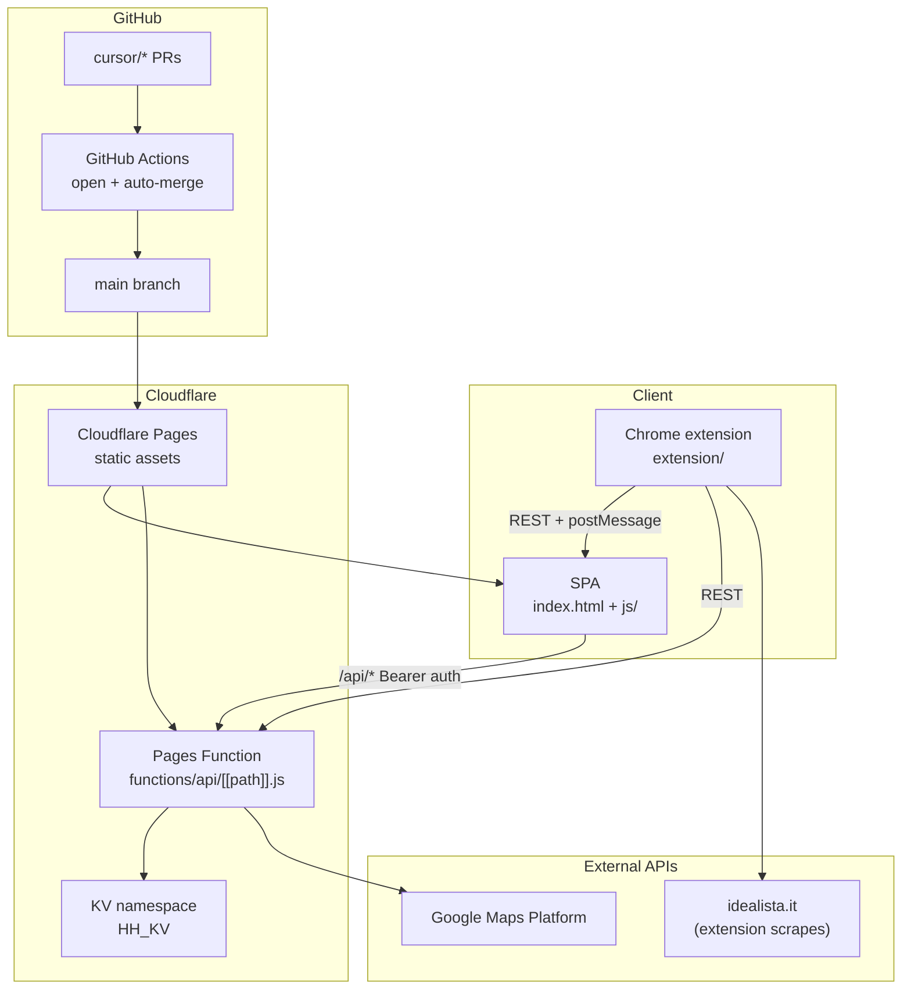

# Infrastructure & setup guide

This document describes the **House Hunt** stack as it exists today and how to stand up a **new project** that reuses the same pattern. It is written for humans, Cursor Desktop agents, and Cursor Cloud agents.

For day-to-day agent workflow and local dev quirks, see [`AGENTS.md`](../AGENTS.md). For the PR auto-ship pipeline, see [`.github/CLOUD_SHIP_SETUP.md`](../.github/CLOUD_SHIP_SETUP.md).

---

## Architecture overview

House Hunt is a **build-less** application: static SPA + edge API + optional Chrome extension. There is no bundler, `package.json`, or compile step.



### Request flow (production)

1. **Browser** loads the SPA from Cloudflare Pages (`*.pages.dev` or custom domain).
2. **SPA** calls `/api/*` on the same origin. Every request carries a shared bearer token.
3. **Pages Function** validates auth, reads/writes **KV**, and proxies **Google Maps** calls server-side when `GMAPS_KEY` is set.
4. **Chrome extension** scrapes Idealista listings, syncs favorites (IFL), and relays data to an open SPA tab via `postMessage` / custom DOM events.
5. **Deploys** reach production only when a PR merges to `main`; Cloudflare Pages rebuilds from that commit.

---

## Components

### 1. Single-page application (SPA)

| Item | Location | Role |
|------|----------|------|
| Shell + app logic | `index.html` | Main UI, tabs (Properties, Map, Day Plan, Settings) |
| ES modules | `js/` | API client, location helpers, config constants |
| Config & version | `js/config.js` | `SPA_VERSION`, API token constants, allowed `postMessage` origins |
| Bootstrap | `js/bootstrap.js` | Loads modules, exposes globals (`HHApi`, `HHLoc`, …) |

**Data flow:** On startup the SPA loads from the API (with `localStorage` fallback), then polls `GET /api/sync` every few seconds for multi-tab / multi-user consistency.

**Local persistence keys** (browser `localStorage`): property data, bases, airports, API key cache, and various one-time migration flags. Keys are versioned in `js/config.js` (e.g. `LS_KEY`, `LS_BASES`).

### 2. API (Cloudflare Pages Function)

| Item | Location | Role |
|------|----------|------|
| Catch-all handler | `functions/api/[[path]].js` | All `/api/*` routes in one Worker-style module |

**Binding:** `env.HH_KV` — Cloudflare KV namespace (binding name must match what Pages expects).

**Auth:** Every route except CORS `OPTIONS` requires either:

- `Authorization: Bearer <token>` header, or
- `?tk=<token>` query parameter

The token is defined in the function source and mirrored in the SPA and extension (see [Secrets & auth](#secrets--auth)).

**KV keys (current schema):**

| Key | Purpose |
|-----|---------|
| `data` | Property records (JSON array or `{ props: [...] }`) |
| `data-rev` | Monotonic revision for sync |
| `bases` | Hunt “base” lodging config |
| `bases-rev` | Bases revision for sync |
| `locks` | Short-lived property edit locks |
| `snapshots-index` | Snapshot metadata list |
| `snapshot:{id}` | Snapshot payload |
| `app-settings` | Server-side app settings |
| `ifl-sync-log` | Idealista sync audit log |

**Representative API routes:**

| Method | Path | Description |
|--------|------|-------------|
| GET | `/api/data` | Full property payload + revision |
| PUT | `/api/data` | Save properties (optimistic merge on conflict) |
| GET | `/api/sync` | Lightweight poll (`rev`, `basesRev`, locks, deltas) |
| GET/PUT | `/api/bases` | Base configuration |
| GET/PUT | `/api/settings` | App settings |
| GET/POST | `/api/snapshots` | List / create snapshots |
| POST | `/api/snapshots/restore` | Restore from snapshot |
| DELETE | `/api/snapshots/:id` | Delete snapshot |
| POST/DELETE | `/api/lock` | Property edit lock |
| POST | `/api/ifl-sync` | Server-side Idealista favorites sync |
| GET | `/api/geocode`, `/api/reverse-geocode` | Forward / reverse geocoding (needs `GMAPS_KEY`) |
| GET | `/api/drive-time`, `/api/directions` | Driving routes (Google + OSRM fallback) |
| GET | `/api/elevation` | Elevation lookup |
| GET | `/api/find-base-towns` | Town search helper |

### 3. Cloudflare Pages + KV

| Concern | Detail |
|---------|--------|
| **Hosting** | Static files at repo root (`index.html`, `js/`, assets) |
| **Functions** | `functions/` directory auto-deployed as Pages Functions |
| **Storage** | KV namespace bound as `HH_KV` |
| **Secrets / env** | Set in Cloudflare dashboard (production + preview): at minimum `GMAPS_KEY` |
| **No `wrangler.toml`** | Production is wired via the Pages project in Cloudflare; local dev uses CLI flags (below) |

Production URL (current): `https://househunt.pages.dev`

### 4. Chrome extension (Manifest V3)

| File | Role |
|------|------|
| `manifest.json` | Permissions, content-script matches, version |
| `content.js` | Injected on Idealista listing pages; scrapes listing data |
| `spa_relay.js` | Injected on SPA origins; relays extension messages into page context |
| `background.js` | Service worker: IFL sync jobs, SPA tab relay |
| `sync.js` | IFL scrape + API sync logic |
| `popup.html` / `popup.js` | Extract tab + Sync IFL tab UI |

**Extension ↔ SPA bridge:**

1. Extension finds an open tab whose URL contains a configurable fragment (default: production hostname).
2. `background.js` uses `chrome.scripting.executeScript` or `spa_relay.js` dispatches a custom DOM event.
3. SPA listens for `postMessage` / relay events with types like `HOUSEHUNT_BROKER` and `HOUSEHUNT_IFL_ADD`.
4. Allowed origins are enforced in `js/config.js` → `HH_MSG_ORIGINS` and `isAllowedHouseHuntOrigin()`.

**Extension is not deployed by Cloudflare.** After API/SPA changes, developers pull `main` and **Reload** the unpacked extension in Chrome when `extension/` changed.

**`chrome.storage.local` keys:** `apiToken`, `apiTokenVer`, `spaUrl`, `savedIflUrl`, `pendingData`, `iflSyncStatus`.

### 5. Ship pipeline (summary)

Changes ship via **feature branches** (`cursor/<description>-<suffix>`), not direct pushes to `main`.

| Step | Tooling |
|------|---------|
| Pre-ship validation | `scripts/smoke-check.sh` (regression markers + version alignment) |
| Desktop ship | `scripts/deploy.ps1` or `deploy.cmd` |
| Cloud / Linux ship | `scripts/ship.sh` |
| PR open + merge | GitHub Actions (see `.github/CLOUD_SHIP_SETUP.md`) |
| Production deploy | Cloudflare Pages on merge to `main` |

Branch protection blocks direct `main` pushes. Auto-merge waits for the **Cloudflare Pages** check and a short settle period after the last push.

---

## Secrets & auth

House Hunt uses a **shared static bearer token** for API access—not user accounts. Treat it as a shared secret for a small trusted group.

### Where the token must stay in sync

When provisioning a **new** deployment, generate one secret string and set it in **all** of these places:

| Layer | File | Constant |
|-------|------|----------|
| API | `functions/api/[[path]].js` | `TOKEN` |
| SPA | `js/config.js` | `API_TOKEN`, `API_TOKEN_VER` |
| Extension | `extension/sync.js` | `DEFAULT_API_TOKEN`, `API_TOKEN_VER` |

`API_TOKEN_VER` is a **version stamp**. When you rotate the token, bump `API_TOKEN_VER` to the same value so clients overwrite stale keys in `localStorage` / `chrome.storage.local`.

### Runtime storage (clients)

| Store | Keys | Behavior |
|-------|------|----------|
| SPA `localStorage` | `hh_api_key`, `hh_api_key_ver` | Cached copy; refreshed when `API_TOKEN_VER` changes |
| Extension `chrome.storage.local` | `apiToken`, `apiTokenVer` | Same pattern; popup “Server key” can override |

### Server-only secrets (Cloudflare environment)

| Variable | Scope | Purpose |
|----------|-------|---------|
| `GMAPS_KEY` | Pages Function `env` | Google Maps Platform API key (never exposed to browser) |

### Client-embedded keys (SPA)

Some third-party keys may live in `js/config.js` (e.g. Gemini). These are visible to anyone who loads the SPA. Prefer server-side proxies for keys that must stay secret.

### What not to commit

`.gitignore` excludes `.env`, `*.pem`, `credentials.json`, `secrets.json`, etc. Ship scripts also block commits that match common secret filenames.

---

## Google Maps (`GMAPS_KEY`)

Geocoding, driving directions, transit estimates, and elevation are proxied through the API so the key stays on the server.

### APIs to enable (same Google Cloud project / key)

Enable these on the key used for `GMAPS_KEY`:

- **Geocoding API** — town → coordinates (`/api/geocode`, `/api/reverse-geocode`)
- **Directions API** — drive routes and durations (`/api/drive-time`, `/api/directions`)
- **Elevation API** — property elevation (`/api/elevation`)

Restrict the key in Google Cloud Console (HTTP referrers for any client-side use; IP / API restrictions for server-side). The Worker calls Google from Cloudflare’s edge.

### Cloudflare configuration

Add `GMAPS_KEY` as an **environment variable** (or secret) on the Pages project for **Production** and **Preview** environments. The binding name must be exactly `GMAPS_KEY` — the function reads `env.GMAPS_KEY`.

### Behavior without the key

| Endpoint | Without `GMAPS_KEY` |
|----------|---------------------|
| `/api/geocode` | Returns `{ source: 'none', note: 'Set GMAPS_KEY…' }` — **town-only property entry fails** |
| `/api/reverse-geocode`, drive-time, elevation | Return offline **fallback estimates** so GPS-coordinate entry still works |

### Local development

```bash
npx wrangler pages dev . --kv HH_KV --port 8788 --ip 127.0.0.1
```

Wrangler does not load `GMAPS_KEY` unless you pass it, e.g.:

```bash
GMAPS_KEY=your_key_here npx wrangler pages dev . --kv HH_KV --port 8788 --ip 127.0.0.1
```

Or use a `.dev.vars` file (git-ignored) with `GMAPS_KEY=…` when using Wrangler’s vars support.

**Local dev tip:** Enter **GPS coordinates directly** in add/edit forms when `GMAPS_KEY` is unset; reverse-geocode and drive-time fallbacks still populate location fields.

---

## Chrome extension setup

### Load for development

1. Open Chrome → **Extensions** → enable **Developer mode**.
2. **Load unpacked** → select the `extension/` directory.
3. Log into [idealista.it](https://www.idealista.it) in the same browser profile.
4. Open the SPA tab (local `http://127.0.0.1:8788` or production).
5. Open the extension popup:
   - **Extract** tab — scrape a single listing page.
   - **Sync IFL** tab — sync an Idealista favorites list (IFL) to a base.

### Configuration (popup)

| Field | Purpose |
|-------|---------|
| **SPA URL (partial match)** | Substring used to find the SPA tab (e.g. `127.0.0.1:8788` or your `*.pages.dev` hostname) |
| **Server key** | Bearer token; defaults from `sync.js` constants, stored in `chrome.storage.local` |

### Host permissions (new project)

Update `extension/manifest.json` if your SPA origin differs:

- `host_permissions` and content-script `matches` for your Pages URL pattern
- Idealista URLs remain `https://www.idealista.it/*`

Update hardcoded API base URLs in `extension/sync.js` if the extension should call production directly (IFL sync path).

### After production deploy

Extension code is **not** auto-updated. When `extension/` changes on `main`:

1. `git pull` on `main`
2. Chrome → Extensions → **Reload** on House Hunt Extractor

---

## Local development

### Prerequisites

- Git
- Node.js (for `npx wrangler` only — no project `npm install`)
- Chrome (for extension testing)

### Run SPA + API + KV together

```bash
npx wrangler pages dev . --kv HH_KV --port 8788 --ip 127.0.0.1
```

Open `http://127.0.0.1:8788/`.

**Do not** use a plain static file server for full-stack work — `/api/*` will not run and KV will be unavailable.

### Auth in local dev

The SPA injects the bearer token from `js/config.js` automatically. No manual key entry is required unless you changed the token.

### Smoke check (pre-ship)

```bash
bash scripts/smoke-check.sh
```

Validates regression markers in `scripts/smoke-markers.txt` and SPA/extension version alignment.

---

## New project checklist

Use this when cloning the stack for a **new** deployment or fork. Order matters for dependencies.

### Cloudflare

- [ ] Create a **Cloudflare Pages** project connected to the GitHub repo (`main` = production branch).
- [ ] Create a **KV namespace** and bind it to the Pages project as **`HH_KV`**.
- [ ] Set environment variable **`GMAPS_KEY`** (production + preview).
- [ ] Note the Pages URL (`<project>.pages.dev`) or attach a custom domain.

### Secrets & auth

- [ ] Generate a new random bearer token (e.g. 24+ hex chars).
- [ ] Set `TOKEN` in `functions/api/[[path]].js`.
- [ ] Set `API_TOKEN` and `API_TOKEN_VER` in `js/config.js` (use the same value for both when first provisioning).
- [ ] Set `DEFAULT_API_TOKEN` and `API_TOKEN_VER` in `extension/sync.js`.
- [ ] Remove or replace any other embedded API keys in `js/config.js` (e.g. Gemini) per your project needs.

### Origins & URLs

- [ ] Add your Pages URL to `HH_MSG_ORIGINS` in `js/config.js`.
- [ ] Update default SPA hostname fragments in extension files (`popup.js`, `background.js`, `content.js`, `sync.js`) or rely on popup override.
- [ ] Update `extension/sync.js` API base URL if using direct API calls.
- [ ] Update `extension/manifest.json` `host_permissions` / content-script `matches` for your SPA origin.

### GitHub & ship pipeline

- [ ] Enable branch protection on `main` (require PR, require Cloudflare Pages check).
- [ ] Copy `.github/workflows/` and configure Actions permissions (see `.github/CLOUD_SHIP_SETUP.md`).
- [ ] Verify `scripts/smoke-check.sh` passes before first ship.

### Chrome extension

- [ ] Rename extension in `manifest.json` if desired.
- [ ] Load unpacked from `extension/` for testing.
- [ ] Confirm Idealista scrape + SPA relay on your dev URL.

### Verify end-to-end

- [ ] SPA loads and polls `/api/sync` without 401 errors.
- [ ] Create a **Base** in Settings and assign a property (unassigned `UNA` properties are hidden from the default list).
- [ ] Geocode a town (requires `GMAPS_KEY`) or add a property by GPS.
- [ ] Extension extract → SPA receive works with SPA tab open.
- [ ] IFL sync updates properties via `/api/ifl-sync`.

---

## Current state snapshot (House Hunt)

*As of documentation date — see `js/config.js` and `extension/manifest.json` for live versions.*

| Component | Value |
|-----------|-------|
| Production URL | `https://househunt.pages.dev` |
| SPA version | `js/config.js` → `SPA_VERSION` |
| Extension version | `extension/manifest.json` → `version` |
| API | No semver; version noted in `functions/api/[[path]].js` header comment |
| KV binding name | `HH_KV` |
| Deploy trigger | Merge to `main` → Cloudflare Pages |
| Ship branch pattern | `cursor/<description>-<suffix>` |
| Desktop ship suffix | `-fb87` (`scripts/deploy.ps1`) |
| Cloud agent ship suffix | `-76bb` (or agent-specific suffix) |
| Local dev command | `npx wrangler pages dev . --kv HH_KV --port 8788 --ip 127.0.0.1` |
| Primary external scrape target | `idealista.it` (Chrome extension) |

### Repo layout (infrastructure-relevant)

```
├── index.html                 # SPA shell
├── js/                        # ES modules (config, API client, …)
├── functions/api/[[path]].js  # Edge API
├── extension/                 # Chrome MV3 extension
├── scripts/
│   ├── smoke-check.sh         # Pre-ship validation
│   ├── ship.sh                # Cloud/Linux ship
│   └── deploy.ps1             # Desktop ship
├── .github/workflows/         # PR open, auto-merge, cleanup
└── docs/setup.md              # This file
```

---

## Related documentation

| Document | Contents |
|----------|----------|
| [`README.md`](../README.md) | Product overview, API table, ship commands |
| [`AGENTS.md`](../AGENTS.md) | Agent/local dev quick reference |
| [`PROJECT_STATE`](../PROJECT_STATE) | Current phase, must-keep features, versions |
| [`.github/CLOUD_SHIP_SETUP.md`](../.github/CLOUD_SHIP_SETUP.md) | PR pipeline, auto-merge, stuck-PR recovery |
